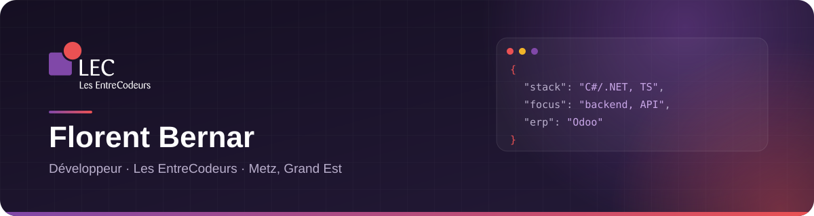

  <a href="https://lesentrecodeurs.com">
    <picture>
      <source media="(prefers-color-scheme: dark)" srcset="assets/banner-dark.svg" />
      <source media="(prefers-color-scheme: light)" srcset="assets/banner-light.svg" />
      
    </picture>
  </a>

<h1 align="center">Hi, I'm Florent Bernar</h1>

  aka <strong>FloBer57</strong> · Software Developer
  <a href="https://lesentrecodeurs.com">@ Les EntreCodeurs</a>

  
  
  
  

---

##  &nbsp;Where I work

> **« Un partenaire unique pour piloter et faire évoluer tout votre système IT »**

Je suis développeur chez **[Les EntreCodeurs](https://lesentrecodeurs.com)**, ESN du **groupe Alliances** —
plus de **50 clients depuis 2021**, présents sur **6 villes** du Grand Est et au Luxembourg.

<table>
  <tr>
    <td width="50%" valign="top">

**Ce qu'on fait**

- 🧩 Applications web & mobiles sur mesure
- 🟣 Intégration **Odoo** (ERP) — *Odoo Learning Partner*
- 🤖 Intelligence artificielle & agents autonomes
- ☁️ Infogérance & cloud
- 🔒 Cybersécurité
- 🛒 E-commerce et solutions B2B

</td>
    <td width="50%" valign="top">

**Mon terrain de jeu**

- ⚙️ Backends, APIs et architectures microservices
- 🧱 Conception de services .NET / Node
- 🗄️ Modélisation de données & performances SQL
- 🚢 Docker, Kubernetes, CI/CD GitHub Actions
- 🔌 Intégrations et modules Odoo
- 🌐 Sites et applications front-end

</td>
  </tr>
</table>

  <a href="https://lesentrecodeurs.com">🌐 lesentrecodeurs.com</a> &nbsp;·&nbsp;
  <a href="https://www.linkedin.com/company/lesentrecodeurs/">💼 LinkedIn</a> &nbsp;·&nbsp;
  📍 7 rue Claude Chappe, 57070 Metz

---

## Languages and Tools

  

---

## Metrics

  

  

  Assets et identité visuelle : <a href="https://lesentrecodeurs.com">Les EntreCodeurs</a>

